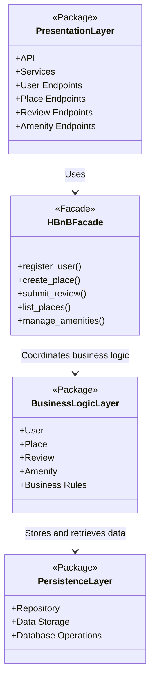

# 0. High-Level Package Diagram

## Objective

The objective of this document is to create a high-level package diagram that represents the three-layer architecture of the HBnB Evolution application.

The application is divided into three main layers:

- Presentation Layer
- Business Logic Layer
- Persistence Layer

The communication between the Presentation Layer and the Business Logic Layer is simplified using the Facade Pattern.

---

## High-Level Package Diagram

---

## Explanatory Notes

### Presentation Layer

The Presentation Layer is responsible for handling the interaction between users and the application.

This layer contains the services and API endpoints that receive requests from users. Examples of requests include user registration, place creation, review submission, and listing places.

The Presentation Layer does not contain the core business rules. Its main responsibility is to receive requests, validate the input when needed, and forward the request to the facade.

### Facade Pattern

The Facade Pattern provides a simplified interface between the Presentation Layer and the Business Logic Layer.

Instead of allowing the API endpoints to directly interact with multiple business classes, the Presentation Layer communicates with a single facade class named `HBnBFacade`.

The facade coordinates the correct operation and calls the appropriate business logic objects.

This improves organization, reduces coupling, and makes the system easier to maintain.

### Business Logic Layer

The Business Logic Layer contains the core models and business rules of the application.

This layer includes the main entities of the system:

- `User`
- `Place`
- `Review`
- `Amenity`

It is responsible for managing the behavior and relationships of these entities.

### Persistence Layer

The Persistence Layer is responsible for storing and retrieving data.

This layer communicates with the database or storage system. It handles operations such as saving, updating, deleting, and retrieving objects.

The Business Logic Layer communicates with the Persistence Layer when data needs to be persisted.

---

## Communication Flow

The general communication flow is:

1. A user sends a request to an API endpoint in the Presentation Layer.
2. The Presentation Layer forwards the request to the `HBnBFacade`.
3. The facade coordinates the operation with the Business Logic Layer.
4. The Business Logic Layer applies the required business rules.
5. If data needs to be saved or retrieved, the Business Logic Layer communicates with the Persistence Layer.
6. The result is returned back through the facade.
7. The Presentation Layer sends the response back to the user.

---

## Design Decision

The layered architecture was selected to separate responsibilities inside the application.

Each layer has a specific role:

- The Presentation Layer handles user interaction.
- The Facade simplifies communication.
- The Business Logic Layer handles business rules.
- The Persistence Layer handles data storage.

This structure makes the project easier to extend, test, and maintain.