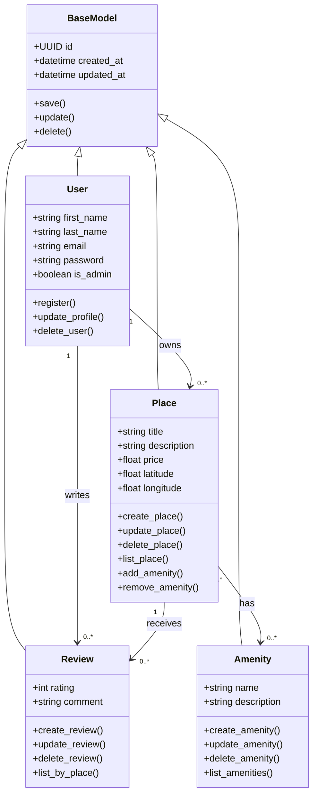

# 1. Detailed Class Diagram for Business Logic Layer

## Objective

The objective of this document is to design a detailed class diagram for the Business Logic Layer of the HBnB Evolution application.

This diagram represents the main entities of the system, including their attributes, methods, and relationships.

The main entities are:

- `BaseModel`
- `User`
- `Place`
- `Review`
- `Amenity`

Each entity includes a unique identifier and timestamps for creation and update dates.

---

## Business Logic Class Diagram

---

## Explanatory Notes

### BaseModel

`BaseModel` is the parent class for the main business entities.

It contains common attributes that every entity must have:

- `id`: A unique identifier using UUID.
- `created_at`: The date and time when the object was created.
- `updated_at`: The date and time when the object was last updated.

It also contains common methods such as:

- `save()`
- `update()`
- `delete()`

Using a base class avoids repeating the same attributes and methods in every entity.

### User

The `User` class represents a user of the application.

A user has:

- first name
- last name
- email
- password
- administrator status

A user can register, update their profile, and be deleted.

A user can own multiple places and write multiple reviews.

### Place

The `Place` class represents a property listed in the application.

A place has:

- title
- description
- price
- latitude
- longitude

Each place is associated with the user who created it.

A place can have multiple reviews and multiple amenities.

### Review

The `Review` class represents feedback left by a user for a place.

A review includes:

- rating
- comment

Each review is associated with one user and one place.

A place can have multiple reviews.

### Amenity

The `Amenity` class represents a feature that can be associated with a place.

Examples of amenities include Wi-Fi, parking, pool, air conditioning, or breakfast.

An amenity has:

- name
- description

A place can have multiple amenities, and the same amenity can be associated with multiple places.

---

## Relationships

### Inheritance

The classes `User`, `Place`, `Review`, and `Amenity` inherit from `BaseModel`.

This allows all entities to share common attributes and methods such as `id`, `created_at`, `updated_at`, `save()`, `update()`, and `delete()`.

### User and Place

A user can own zero or many places.

Each place belongs to one user.

### User and Review

A user can write zero or many reviews.

Each review belongs to one user.

### Place and Review

A place can receive zero or many reviews.

Each review belongs to one place.

### Place and Amenity

A place can have multiple amenities.

An amenity can also be associated with multiple places.

This is a many-to-many relationship.