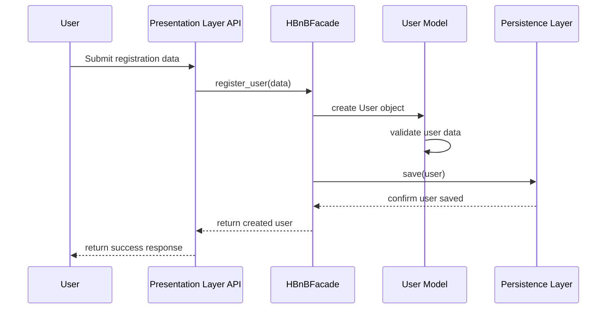
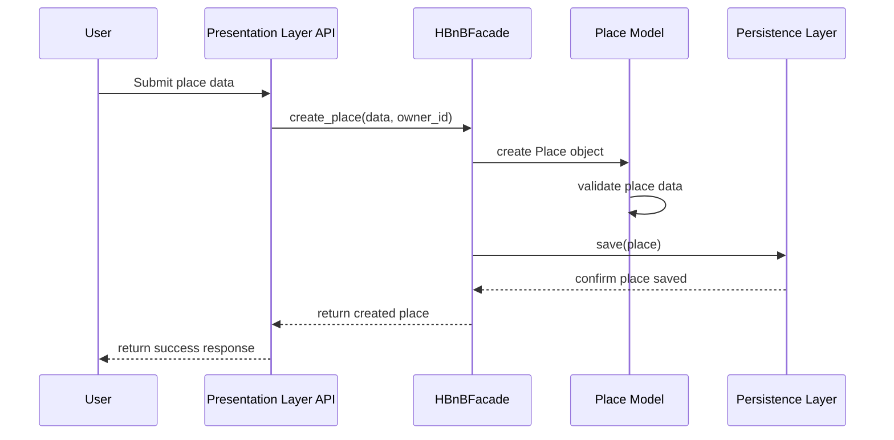
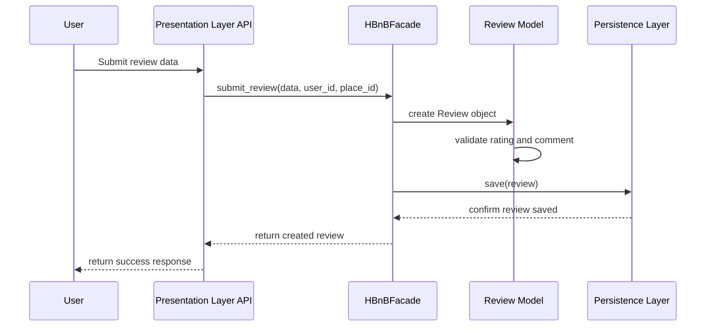
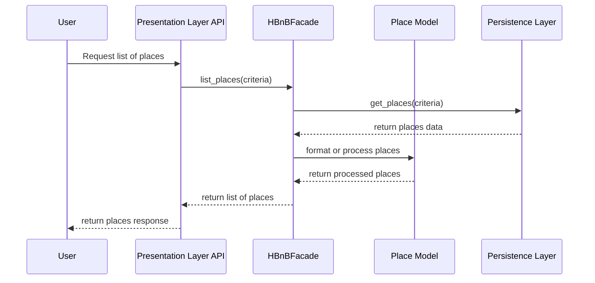

# 2. Sequence Diagrams for API Calls

## Objective

The objective of this document is to show how different API calls move through the layers of the HBnB Evolution application.

The sequence diagrams show the interaction between:

- User
- API
- HBnBFacade
- Business Logic Layer
- Persistence Layer

The selected API calls are:

- User Registration
- Place Creation
- Review Submission
- Fetching a List of Places

---

## 2.1 User Registration

### Description

This sequence diagram shows the process of registering a new user.

The user sends registration data to the API. The API forwards the request to the facade. The facade coordinates the creation of the user in the Business Logic Layer. The new user is then saved through the Persistence Layer.

### Explanatory Notes

The API receives the registration request and passes it to the `HBnBFacade`.

The facade creates a new `User` object and validates the required information. Once the user is created, the object is saved through the Persistence Layer.

Finally, the success response is returned to the user.

---

## 2.2 Place Creation

### Description

This sequence diagram shows the process of creating a new place.

A registered user submits the place information through the API. The facade coordinates the operation with the `Place` model and saves the new place through the Persistence Layer.

### Explanatory Notes

The user sends the place information to the API.

The API forwards the request to the facade. The facade creates a `Place` object and ensures that the place data follows the required business rules.

The place is then saved in the Persistence Layer.

---

## 2.3 Review Submission

### Description

This sequence diagram shows how a user submits a review for a place.

The user sends the review information to the API. The facade coordinates the creation of the review and saves it through the Persistence Layer.

### Explanatory Notes

The user submits a rating and comment for a place.

The API sends the request to the facade. The facade creates the review object and validates the review data.

After validation, the review is stored through the Persistence Layer and a success response is returned.

---

## 2.4 Fetching a List of Places

### Description

This sequence diagram shows how a user requests a list of available places.

The API receives the request and sends it to the facade. The facade asks the Persistence Layer for the places that match the request criteria.

### Explanatory Notes

The user requests a list of places.

The API sends the request to the facade, and the facade retrieves the data from the Persistence Layer.

The Business Logic Layer can process or format the place data before returning it to the API.

The API then sends the list of places back to the user.