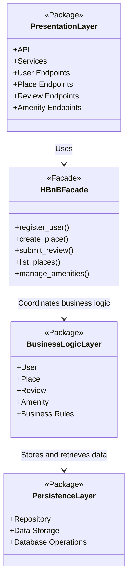
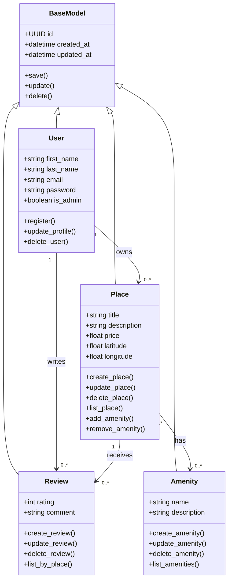
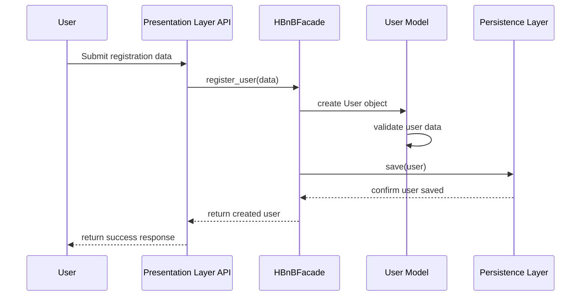
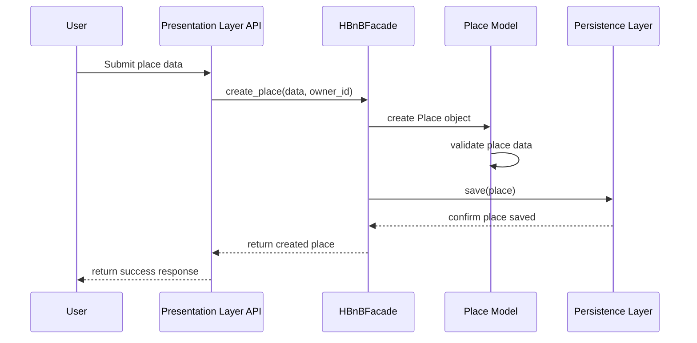
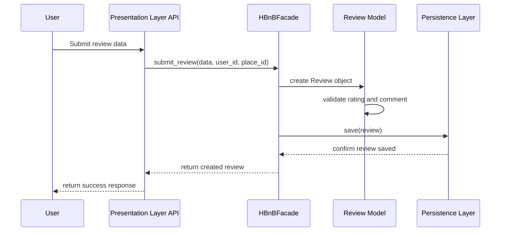
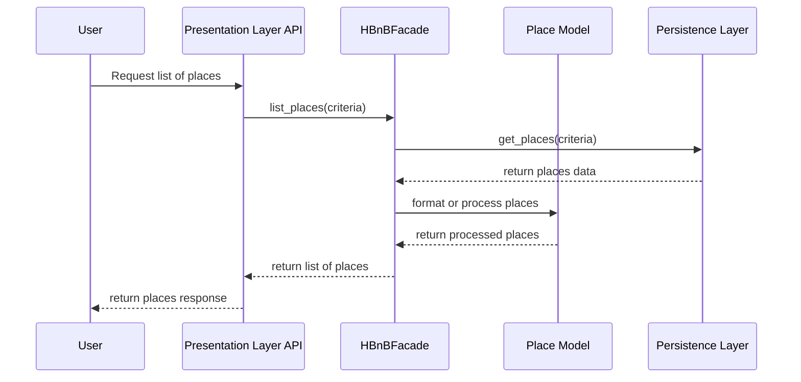

# HBnB Evolution - Technical Documentation

## Introduction

This document provides the technical documentation for Part 1 of the HBnB Evolution project.

HBnB Evolution is a simplified AirBnB-like application that allows users to register, manage places, submit reviews, and manage amenities. The goal of this document is to define the system architecture, the structure of the business logic layer, and the interaction flow between the main layers of the application.

This documentation will serve as a blueprint for the implementation phases of the project.

---

# 0. High-Level Package Diagram

## Objective

The objective of this section is to represent the high-level architecture of the HBnB Evolution application using a layered architecture.

The application is divided into three main layers:

* Presentation Layer
* Business Logic Layer
* Persistence Layer

The communication between the Presentation Layer and the Business Logic Layer is simplified using the Facade Pattern.

---

## High-Level Package Diagram

---

## Explanatory Notes

### Presentation Layer

The Presentation Layer is responsible for handling the interaction between users and the application.

This layer contains the services and API endpoints that receive requests from users. Examples of requests include user registration, place creation, review submission, and listing places.

The Presentation Layer does not contain the core business rules. Its main responsibility is to receive requests, validate the input when needed, and forward the request to the facade.

### Facade Pattern

The Facade Pattern provides a simplified interface between the Presentation Layer and the Business Logic Layer.

Instead of allowing the API endpoints to directly interact with multiple business classes, the Presentation Layer communicates with a single facade class named `HBnBFacade`.

The facade coordinates the correct operation and calls the appropriate business logic objects.

This improves organization, reduces coupling, and makes the system easier to maintain.

### Business Logic Layer

The Business Logic Layer contains the core models and business rules of the application.

This layer includes the main entities of the system:

* `User`
* `Place`
* `Review`
* `Amenity`

It is responsible for managing the behavior and relationships of these entities.

### Persistence Layer

The Persistence Layer is responsible for storing and retrieving data.

This layer will communicate with the database or storage system. It handles operations such as saving, updating, deleting, and retrieving objects.

The Business Logic Layer communicates with the Persistence Layer when data needs to be persisted.

---

## Communication Flow

The general communication flow is:

1. A user sends a request to an API endpoint in the Presentation Layer.
2. The Presentation Layer forwards the request to the `HBnBFacade`.
3. The facade coordinates the operation with the Business Logic Layer.
4. The Business Logic Layer applies the required business rules.
5. If data needs to be saved or retrieved, the Business Logic Layer communicates with the Persistence Layer.
6. The result is returned back through the facade.
7. The Presentation Layer sends the response back to the user.

---

# 1. Detailed Class Diagram for Business Logic Layer

## Objective

The objective of this section is to design a detailed class diagram for the Business Logic Layer of the HBnB Evolution application.

This diagram represents the main entities of the system, including their attributes, methods, and relationships.

The main entities are:

* `BaseModel`
* `User`
* `Place`
* `Review`
* `Amenity`

Each entity includes a unique identifier and timestamps for creation and update dates.

---

## Business Logic Class Diagram

---

## Explanatory Notes

### BaseModel

`BaseModel` is the parent class for the main business entities.

It contains common attributes that every entity must have:

* `id`: A unique identifier using UUID.
* `created_at`: The date and time when the object was created.
* `updated_at`: The date and time when the object was last updated.

It also contains common methods such as:

* `save()`
* `update()`
* `delete()`

Using a base class avoids repeating the same attributes and methods in every entity.

### User

The `User` class represents a user of the application.

A user has:

* first name
* last name
* email
* password
* administrator status

A user can register, update their profile, and be deleted.

A user can own multiple places and write multiple reviews.

### Place

The `Place` class represents a property listed in the application.

A place has:

* title
* description
* price
* latitude
* longitude

Each place is associated with the user who created it.

A place can have multiple reviews and multiple amenities.

### Review

The `Review` class represents feedback left by a user for a place.

A review includes:

* rating
* comment

Each review is associated with one user and one place.

A place can have multiple reviews.

### Amenity

The `Amenity` class represents a feature that can be associated with a place.

Examples of amenities include Wi-Fi, parking, pool, air conditioning, or breakfast.

An amenity has:

* name
* description

A place can have multiple amenities, and the same amenity can be associated with multiple places.

---

## Relationships

### Inheritance

The classes `User`, `Place`, `Review`, and `Amenity` inherit from `BaseModel`.

This allows all entities to share common attributes and methods such as `id`, `created_at`, `updated_at`, `save()`, `update()`, and `delete()`.

### User and Place

A user can own zero or many places.

Each place belongs to one user.

### User and Review

A user can write zero or many reviews.

Each review belongs to one user.

### Place and Review

A place can receive zero or many reviews.

Each review belongs to one place.

### Place and Amenity

A place can have multiple amenities.

An amenity can also be associated with multiple places.

This is a many-to-many relationship.

---

# 2. Sequence Diagrams for API Calls

## Objective

The objective of this section is to show how different API calls move through the layers of the HBnB Evolution application.

The sequence diagrams show the interaction between:

* User
* API
* HBnBFacade
* Business Logic Layer
* Persistence Layer

The selected API calls are:

* User Registration
* Place Creation
* Review Submission
* Fetching a List of Places

---

## 2.1 User Registration

### Description

This sequence diagram shows the process of registering a new user.

The user sends registration data to the API. The API forwards the request to the facade. The facade coordinates the creation of the user in the Business Logic Layer. The new user is then saved through the Persistence Layer.

### Explanatory Notes

The API receives the registration request and passes it to the `HBnBFacade`.

The facade creates a new `User` object and validates the required information. Once the user is created, the object is saved through the Persistence Layer.

Finally, the success response is returned to the user.

---

## 2.2 Place Creation

### Description

This sequence diagram shows the process of creating a new place.

A registered user submits the place information through the API. The facade coordinates the operation with the `Place` model and saves the new place through the Persistence Layer.

### Explanatory Notes

The user sends the place information to the API.

The API forwards the request to the facade. The facade creates a `Place` object and ensures that the place data follows the required business rules.

The place is then saved in the Persistence Layer.

---

## 2.3 Review Submission

### Description

This sequence diagram shows how a user submits a review for a place.

The user sends the review information to the API. The facade coordinates the creation of the review and saves it through the Persistence Layer.

### Explanatory Notes

The user submits a rating and comment for a place.

The API sends the request to the facade. The facade creates the review object and validates the review data.

After validation, the review is stored through the Persistence Layer and a success response is returned.

---

## 2.4 Fetching a List of Places

### Description

This sequence diagram shows how a user requests a list of available places.

The API receives the request and sends it to the facade. The facade asks the Persistence Layer for the places that match the request criteria.

### Explanatory Notes

The user requests a list of places.

The API sends the request to the facade, and the facade retrieves the data from the Persistence Layer.

The Business Logic Layer can process or format the place data before returning it to the API.

The API then sends the list of places back to the user.

---

# 3. Documentation Compilation

## Objective

The objective of this section is to compile all diagrams and explanatory notes into a single comprehensive technical document.

This document includes:

* Introduction
* High-Level Architecture
* Business Logic Layer Class Diagram
* API Interaction Flow
* Explanatory Notes

This document will guide the next implementation phases of the HBnB Evolution project.

---

## Technical Documentation Summary

The HBnB Evolution application follows a layered architecture to separate responsibilities and improve maintainability.

The main layers are:

1. Presentation Layer
2. Business Logic Layer
3. Persistence Layer

The Presentation Layer receives user requests through APIs and services.

The Business Logic Layer contains the core models and business rules of the application.

The Persistence Layer stores and retrieves data from the database or storage system.

The `HBnBFacade` acts as the interface between the Presentation Layer and the Business Logic Layer. This reduces direct dependencies between layers and makes the system easier to extend and maintain.

---

## Design Decisions

### Layered Architecture

The layered architecture was chosen because it separates the application into clear responsibilities.

Each layer has a specific role:

* The Presentation Layer handles requests and responses.
* The Business Logic Layer manages rules and entities.
* The Persistence Layer handles data storage.

This separation makes the project easier to understand, test, and maintain.

### Facade Pattern

The Facade Pattern was chosen to simplify communication between the Presentation Layer and the Business Logic Layer.

Instead of exposing all business classes directly to the API, the facade provides a single point of access to the main operations of the system.

### BaseModel Usage

A `BaseModel` class was included to centralize common attributes and methods shared by all entities.

This avoids code duplication and ensures that all main entities include:

* unique ID
* creation date
* update date
* common persistence-related methods

### Entity Relationships

The relationships between entities reflect the business rules of the HBnB Evolution application:

* A user can own many places.
* A user can write many reviews.
* A place can receive many reviews.
* A place can have many amenities.
* An amenity can belong to many places.

These relationships help define how the business logic will be implemented in the next parts of the project.

---

## Conclusion

This technical document provides a complete overview of the architecture and design of the HBnB Evolution application.

It includes the high-level package diagram, the detailed class diagram for the Business Logic Layer, and sequence diagrams for four important API calls.

This documentation will be used as a reference for implementing the application in the next phases of the project.
