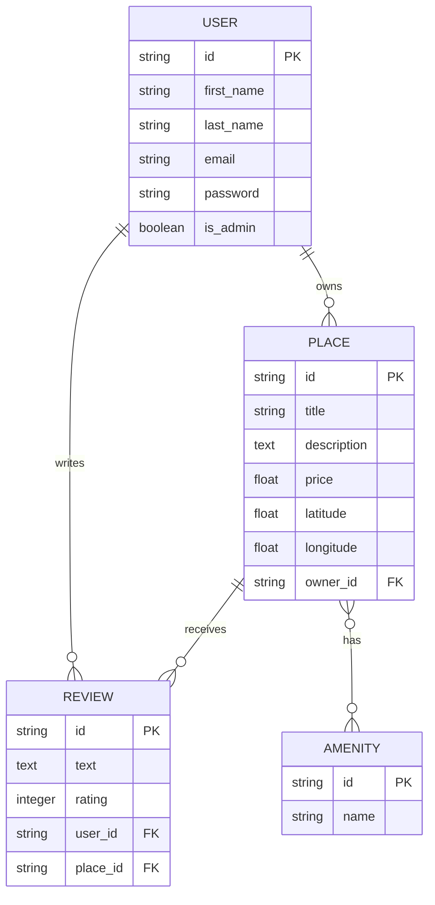

# HBnB Database Schema

## Entity Relationship Diagram

## Database Tables

### users

Stores application users.

Columns:

- id
- first_name
- last_name
- email
- password
- is_admin

### places

Stores properties.

Columns:

- id
- title
- description
- price
- latitude
- longitude
- owner_id

### reviews

Stores user reviews.

Columns:

- id
- text
- rating
- user_id
- place_id

### amenities

Stores available amenities.

Columns:

- id
- name

### place_amenity

Many-to-many relationship table.

Columns:

- place_id
- amenity_id